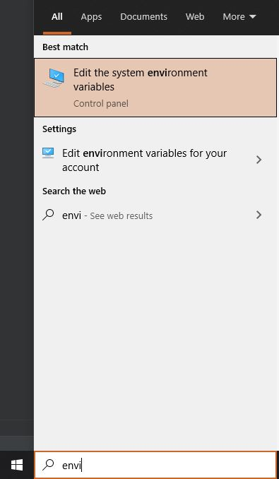
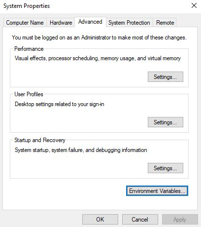

# Protocol Buffer Definitions

## Protobuf Setup For Windows

This ended up being kind of an adventure for me for various reasons. The first step we need to take before doing any project development
on code trying to integrate protobuf will have a *way* easier time if you install Protobuf first. 

### The Install Process

1. Install [VCPKG](https://docs.microsoft.com/en-us/cpp/build/install-vcpkg?view=msvc-160&tabs=windows). Be Aware that there are prerequisite steps 
before the install will succeed. In case you miss them on the page, here they are.
   * Windows 7 or Newer
   * [Git for Windows](https://git-scm.com/downloads)
   * [Visual Studio](https://visualstudio.microsoft.com/) 2015 Update 3 or greater with the English language pack.
   * **And there you have it. I just copy-pasted those lines directly, _from that vcpkg link_ 
     so you essentially have zero excuse to miss these prerequisites.**
2. We need to make sure the VCPKG executable can be accessed via command line.
   * In your start bar, search for "Edit the System Environment Variables." It'll look like this:
     
     
   
   * Click "Environment Variables" at the bottom of the resulting window:
    
      
    
   * We Want to edit our "Path" variable, so select the System's path variable and click "Edit" **NOTE** I'll add a screenshot here, but I want to get a better snip than the last one I had.
    
   * Sweet; now we can add `vcpkg.exe` to our path variable! I installed my version of vcpkg at `C:\vcpkg`:
    
    

3. Open Powershell. I prefer going through [Windows Terminal](https://www.microsoft.com/en-us/p/windows-terminal/9n0dx20hk701?activetab=pivot:overviewtab)

4. type this command into your terminal: `vcpkg install protobuf:x64-windows` (if you are using 32 bit windows, maybe install the 32 bit version instead...)

## [Practice](https://github.com/PixelChaserB/IrrigationStation/tree/main/ProtoBuf/ProtoFiles/Practice)

Practice protobuf data layout with a lightweight practice project. It'll be a silly little thing that is a fake system
to take care of fake parking lots. I'm utilizing a couple of different libraries in here which will be pretty important later
on in our development: [IMGui.Net](https://github.com/mellinoe/ImGui.NET) and protobuf, which this readme has already introduced 
to you at least a little bit.